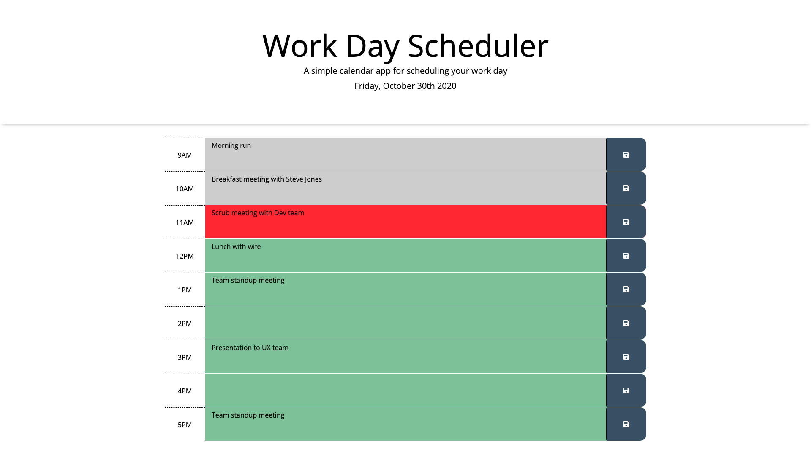

# Work Day Scheduler
A calendar application that allows a user to save events for each hour of the day.

# Usage
The user can click into a row to enter an event, meeting, appointment that they might have at various times of the day. The rows are color cooridinated based on time of day. If the rows are grey, it is in the past. The red row indicates the current hour. The green rows indicate future times in the day. The user can save the event and the event and time information is saved into local storage.

https://evadllewop.github.io/WorkDayScheduler/

# Screenshot

# Built Using...
- Javascript
- jQuery
- HTML
- CSS
- Moment.js
- Bootstrap
- Google Fonts
- Font Awesome